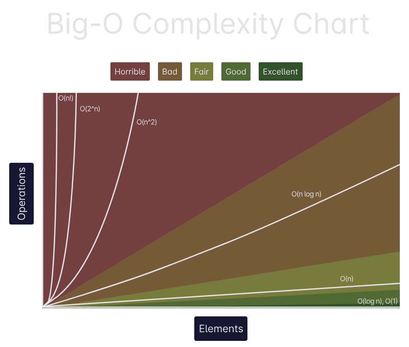

# Data Structure Algorithm (DSA)
They are foundational concepts in computer science and software engineering. They are crucial for writing efficient code, solving complex problems, and performing well in technical interviews.

**Data structures** are ways of organizing and storing data so that it can be accessed and modified efficiently, some of them are: Array, Linked List, Stack, Queue, Hash Table / HasMap, Tree, Graph, Heap, Trie. In the other hand, **Algorithms** are step-by-step procedures or formulas for solving a problem as: Sorting, Searching, Recursion, Dynamic Programming (DP), Greedy, Backtracking, Divide and Conquer, Graph Algorithms, Bit Manipulation.

## Index

- [Abstract Data Type (ADT)](#abstract-data-type-adt)
- [Array](#array)
- [Big-O Notation](#big-o-notation)
  - [Code Examples](#code-example)

---

# Abstract Data Type (ADT)
An ADT is a theoretical model for a data structure that defines the behavior it supports without specifying how those operations are implemented.

Some key features of an ADT are:
1. **Encapsulation:** The implementation details are hidden.
2. **Defined Operations:** The interface exposes only what is necessary (e.g. `add()`, `remove()`, `peek()`).
3. **Implementation-Independent:** Users of the ADT don't need to know how it's implemented.

Here are some examples of ADTs

| ADT   | Java Interfaces or Class               | Description                                          |
|-------|----------------------------------------|------------------------------------------------------|
| List  | `List`, `ArrayList`, `LinkedList`      | Ordered collection of elements. Can access by index. |
| Stack | `Stack`, `Deque`                       | Last-in, First-Out (LIFO) Structure                  |
| Queue | `Queue`, `LinkedList`, `PriorityQueue` | First-In, First-Out (FIFO) Structure                 |
| Set   | `Set`, `HashSet`, `TreeSet`            | Collection of unique elements                        |
| Map   | `Map`, `HashMap`, `TreeMap`            | Key-value with unique keys.                          |

---

# Array
An array is a fixed-size, indexed collection of elements that are all on the same data type. Each element is stored in a contiguous memory location and can be accessed directly using an index, starting from 0.

Arrays are objects, and their size is defined when the array is created and cannot be changed later.

Example:
```java
int[] numbers1 = new int[5]; // creates an array of 5 integers
numbers1[0] = 10;            // sets the first element

// or

int[] number2 = {1,2,3,4,5};
```

Arrays provide fast access to elements using their index, but have a fixed size and no built-in method like dynamic resizing as `ArrayList`.

---

# Big-O Notation
Big-O notation is a mathematical way to describe how the runtime or space requirement of an algorithm grows relative to the input size. It's used to evaluate the efficiency of an algorithm, especially as the input becomes large.

When we analyze an algorithm we want to optimize it in space complexity, using less memory; and/or time complexity, using less time.

To be able to calculate hte time we use the Big-O Notations:

| Complexity   | Meaning       | Example                | 
|--------------|---------------|------------------------|
| O(1)         | Constant time | Access array index     |
| O(log n)     | Logarithmic   | Binary Search          |
| O(n)         | Linear        | Traverse array         |
| O(n log n)   | Log-linear    | Merge Sort             |
| O(n²)        | Quadratic     | Bubble Sort            |
| O(2ⁿ), O(n!) | Exponential   | Recursive combinations |
| O(n!)        | Factorial     | Permutation            |



## Code Example
1. O(1) — Constant Time
```java
public int getFirstElement(int[] arr) {
    return arr[0];
}
```

2. O(log n) — Logarithmic Time
```java
public int binarySearch(int[] arr, int target) {
    int left = 0;
    int right = arr.length - 1;

    while (left <= right) {
        int mid = left + (right - left) / 2;

        if (arr[mid] == target) return mid;
        if (arr[mid] < target) left = mid + 1;
        else right = mid - 1;
    }

    return -1;
}
```

3. O(n) — Linear Time
```java
public void printAll(int[] arr) {
    for (int num : arr) {
        System.out.println(num);
    }
}
```

4. O(n log n) — Log-linear Time
```java
public class MergeSort {
    public void sort(int[] arr, int left, int right) {
        if (left < right) {
            int mid = (left + right) / 2;

            // Recursively sort left and right halves
            sort(arr, left, mid);
            sort(arr, mid + 1, right);

            // Merge the sorted halves
            merge(arr, left, mid, right);
        }
    }

    private void merge(int[] arr, int left, int mid, int right) {
        int n1 = mid - left + 1;
        int n2 = right - mid;

        // Temporary arrays
        int[] L = new int[n1];
        int[] R = new int[n2];

        // Copy data to temp arrays
        for (int i = 0; i < n1; i++)
            L[i] = arr[left + i];
        for (int j = 0; j < n2; j++)
            R[j] = arr[mid + 1 + j];

        // Merge the temp arrays back
        int i = 0, j = 0, k = left;

        while (i < n1 && j < n2) {
            if (L[i] <= R[j]) {
                arr[k++] = L[i++];
            } else {
                arr[k++] = R[j++];
            }
        }

        // Copy remaining elements
        while (i < n1)
            arr[k++] = L[i++];

        while (j < n2)
            arr[k++] = R[j++];
    }

    // Main method for testing
    public static void main(String[] args) {
        int[] arr = {38, 27, 43, 3, 9, 82, 10};
        MergeSort ms = new MergeSort();
        ms.sort(arr, 0, arr.length - 1);

        for (int num : arr) {
            System.out.print(num + " ");
        }
    }
}
```

5. O(n²) — Quadratic Time
```java
public void printPairs(int[] arr) {
    for (int i : arr) {
        for (int j : arr) {
            System.out.println(i + ", " + j);
        }
    }
}
```

6. O(2ⁿ) — Exponential Time
```java
public int fibonacci(int n) {
    if (n <= 1) return n;
    return fibonacci(n - 1) + fibonacci(n - 2);
}
```

7. O(n!) — Factorial Time
```java
public void permute(String str, String result) {
    if (str.length() == 0) {
        System.out.println(result);
        return;
    }

    for (int i = 0; i < str.length(); i++) {
        String remaining = str.substring(0, i) + str.substring(i + 1);
        permute(remaining, result + str.charAt(i));
    }
}
```


